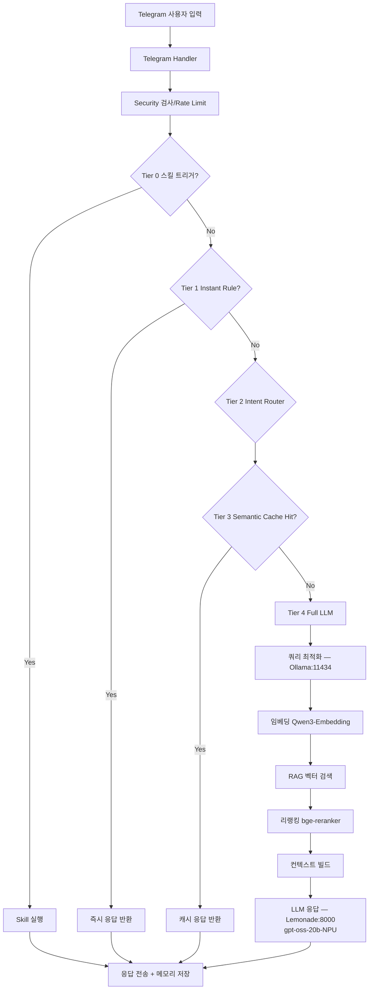
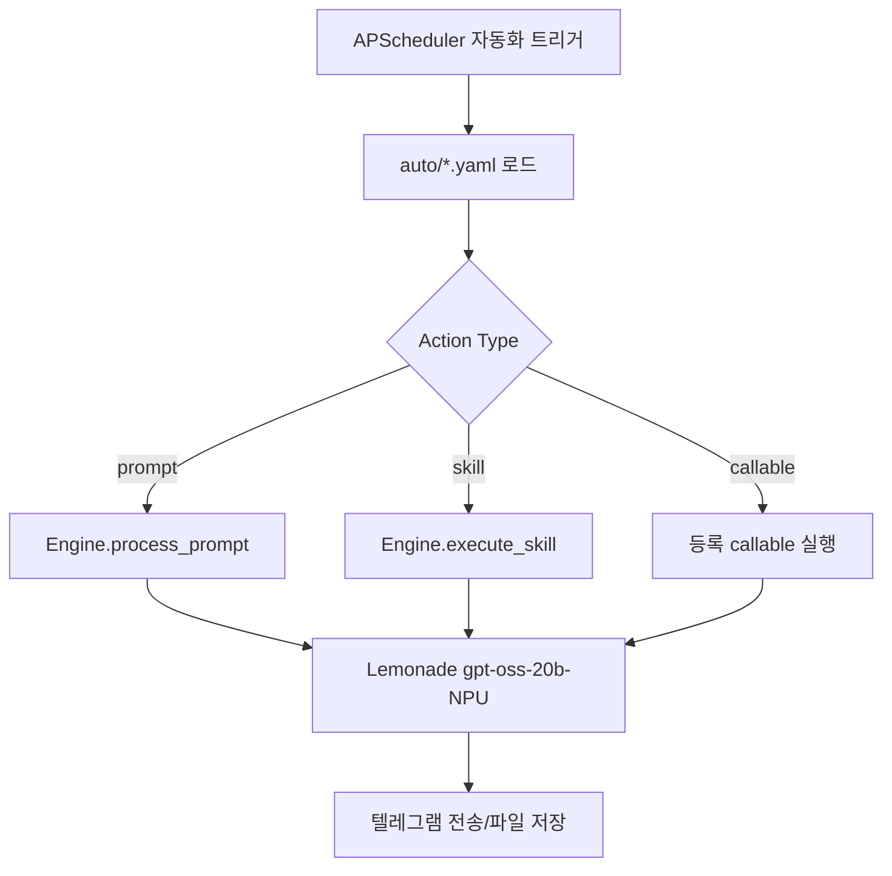

# ollama_bot

**Dual-Provider 아키텍처** 기반 텔레그램 private-chat 봇입니다.

- **Lemonade Server (8000)**: LLM 응답 전담 — `gpt-oss-20b-NPU` 단일 모델 상주
- **Ollama Server (11434)**: 쿼리 최적화 전담 — 임베딩(`Qwen3-Embedding-0.6B-GGUF`) + 리랭킹(`bge-reranker-v2-m3-GGUF`)

현재 코드베이스는 **단일 앱 구조**입니다.
- 엔트리포인트: `apps/ollama_bot/main.py` (`main.py`는 레거시 호환용 래퍼)
- 코어 로직: `core/`
- 설정: `config/config.yaml`
- 컨테이너 실행 기본: `docker compose -f docker-compose.yml up -d`

## 핵심 기능

- 텔레그램 1:1(private chat) 기반 대화
- 스킬 시스템(YAML): `skills/_builtin`, `skills/custom`
- 자동화 시스템(YAML + APScheduler): `auto/_builtin`, `auto/custom`
- 피드백 버튼(👍/👎) + 부정 피드백 사유 수집(옵션)
- 계층형 응답 최적화
  - Tier 0: 스킬 트리거
  - Tier 1: 규칙 기반 즉시 응답(InstantResponder)
  - Tier 2: 인텐트 라우팅(IntentRouter)
  - Tier 3: 시맨틱 캐시(SemanticCache)
  - Tier 4: Full LLM — Ollama(임베딩/리랭킹) → Lemonade(gpt-oss-20b-NPU 응답)
- 장기 메모리/대화 보관(SQLite)
- 보안 기본값
  - 화이트리스트 사용자 인증(`ALLOWED_TELEGRAM_USERS`)
  - 레이트리밋/전역 동시성 제한
  - 경로 검증, 입력 정제
- Docker 하드닝(읽기 전용 루트, no-new-privileges, cap_drop)

## 동작 플로우차트

### 대화 플로우



### 자동화 플로우



## 사전 요구사항

- Python 3.11+
- Docker / Docker Compose
- 임베딩 런타임은 `fastembed`(ONNX Runtime CPU) 기반
- 텔레그램 봇 토큰 (`@BotFather`)
- Dual-Provider 백엔드 (Windows 호스트에서 실행)
  - **Lemonade Server** (포트 8000) — LLM 응답 (`gpt-oss-20b-NPU`)
  - **Ollama Server** (포트 11434) — 임베딩/리랭킹 (`Qwen3-Embedding-0.6B-GGUF`, `bge-reranker-v2-m3-GGUF`)

## 빠른 시작

### 원클릭 설치 (추천)

처음 설치까지 한 줄로 실행:

```bash
git clone <repo-url> && cd ollama_bot && bash scripts/bootstrap.sh
```

이미 리포지토리를 받은 상태라면:

```bash
bash scripts/bootstrap.sh
```

- Dual-Provider 환경(Lemonade + Ollama):
  - Windows 방화벽/portproxy를 자동 설정합니다.
  - 관리자 권한이 필요하면 UAC 팝업이 1회 표시됩니다.
  - WSL 재부팅 없이 바로 적용됩니다.
- 이미지까지 강제 빌드하려면:

```bash
bash scripts/bootstrap.sh --build
```

### 1) 설치

```bash
git clone <repo-url>
cd ollama_bot
bash scripts/setup.sh
```

또는 수동 설치:

```bash
pip install -r requirements-dev.txt
cp .env.example .env
mkdir -p data/conversations data/memory data/logs data/reports
```

### 2) `.env` 설정

`.env`는 텔레그램 관련 시크릿만 사용합니다:

```env
TELEGRAM_BOT_TOKEN=...
ALLOWED_TELEGRAM_USERS=123456789
```

- `ALLOWED_TELEGRAM_USERS`는 **숫자 Chat ID CSV**만 허용됩니다.
- placeholder(`your_telegram_chat_id_here`) 상태면 시작 시 fail-fast로 종료됩니다.
- 런타임 일반 설정(provider/model/host/log/data_dir 등)은 `config/config.yaml`에서 관리합니다.

### 3) LLM 백엔드 준비 (Dual-Provider)

두 서버 모두 Windows 호스트에서 실행되어야 합니다.

#### Lemonade Server (LLM 응답)

- 포트 8000에서 OpenAI-compatible API 제공
- `gpt-oss-20b-NPU` 모델을 상주 로드
- 시작 시 `prepare_model`로 모델 선로드를 보장

#### Ollama Server (쿼리 최적화)

```bash
ollama pull Qwen3-Embedding-0.6B-GGUF
ollama pull bge-reranker-v2-m3-GGUF
ollama serve
```

- 포트 11434에서 임베딩/리랭킹 전담
- 두 모델을 `keep_alive` 설정으로 상주 유지 권장
- RAG 파이프라인에서 벡터 검색 + 리랭킹에 사용

### 4) 실행

```bash
docker compose -f docker-compose.yml up --build -d
```

로그 확인:

```bash
docker compose logs -f ollama_bot
```

상태 확인:

```bash
docker compose ps
```

## 실행 정책/제약

- 기본 정책은 **컨테이너 내부 실행 전용**입니다.
- 로컬 직접 실행 우회가 필요하면 `ALLOW_LOCAL_RUN=1` 환경변수를 사용합니다.
- 텔레그램은 private chat(1:1)만 처리합니다. 그룹/채널 메시지는 거절됩니다.

## CLI 점검

```bash
python -m apps.cli chat
python -m apps.cli dry-run "테스트 질문"
python -m apps.cli test
```

- CLI는 Dual-Provider 설정을 그대로 사용합니다 (Lemonade 응답 + Ollama 임베딩/리랭킹).

## 텔레그램 명령어

| 명령어 | 설명 |
|---|---|
| `/start` | 시작 안내 |
| `/help` | 도움말 |
| `/skills` | 스킬 목록 |
| `/skills reload` | 스킬 strict 리로드 |
| `/auto` 또는 `/auto list` | 자동화 목록 |
| `/auto disable <name>` | 자동화 비활성화 |
| `/auto run <name>` | 자동화 1회 수동 실행 |
| `/auto reload` | 자동화 strict 리로드 |
| `/model` | Dual-Provider 모델 현황 확인 |
| `/model <name>` | 기본 모델 전환 |
| `/memory` | 메모리 통계 |
| `/memory clear` | 현재 채팅 대화 기록 삭제 |
| `/memory export` | 현재 채팅 기록 markdown 내보내기 |
| `/status` | 시스템 상태 |
| `/analyze_all <질문>` | RAG 인덱스 전체 문서를 map-reduce로 읽어 분석 |
| `/feedback` | 피드백 통계 (`feedback.enabled: true`일 때) |
| `/skip` | 부정 피드백 사유 입력 건너뛰기 (`collect_reason: true`일 때) |

## 내장 스킬 (`skills/_builtin`)

| 이름 | 트리거 |
|---|---|
| `summarize` | `/summarize`, `요약해줘` |
| `translate` | `/translate`, `번역해줘` |
| `code_review` | `/review`, `코드 리뷰` |

## 내장 자동화 (`auto/_builtin`)

기본 타임존은 `scheduler.timezone`(기본 `Asia/Seoul`) 기준입니다.

| 이름 | 스케줄(cron) | 설명 |
|---|---|---|
| `preference_extraction` | `0 0 * * *` | 선호도/고정 정보 추출 |
| `feedback_analysis` | `0 2 * * *` | 피드백 분석 후 가이드라인 갱신 |
| `memory_hygiene` | `30 3 * * *` | 메모리 정리 |
| `memory_consolidation` | `0 4 * * sun` | 메모리 통합 압축 |
| `export_training_data` | `0 3 * * 0` | KTO 학습 데이터 내보내기 |
| `daily_summary` | `0 9 * * *` | 전일 대화 요약 |
| `rag_reindex` | `30 3 * * 0` | 주 1회 RAG 증분 재인덱싱 |
| `error_log_triage` | `0 */6 * * *` | 오류 로그 triage |
| `health_check` | `*/30 * * * *` | 주기 헬스체크 |

## 커스텀 스킬 추가

`skills/custom/my_skill.yaml` 예시:

```yaml
name: "my_skill"
description: "내 스킬"
version: "1.0"
triggers:
  - "/myskill"
  - "내 스킬"
system_prompt: |
  당신은 특정 업무를 수행하는 전문가입니다.
allowed_tools: []
parameters:
  - name: "input_text"
    type: "string"
    required: true
    description: "입력"
timeout: 30
model_role: "default"  # optional: default
temperature: 0.7     # optional
max_tokens: 1024     # optional
streaming: true      # optional
security_level: "safe"
```

주의사항:
- `name` 중복 불가
- 트리거 중복 불가
- `/skills reload`는 strict 모드라 오류가 하나라도 있으면 실패합니다.

## 커스텀 자동화 추가

`auto/custom/my_auto.yaml` 예시:

```yaml
name: "my_auto"
description: "매일 리포트"
enabled: true
schedule: "0 8 * * *"
action:
  type: "prompt"   # skill | prompt | callable | command
  target: "오늘의 핵심 이슈를 요약해줘"
  model_role: "default"
  parameters: {}
output:
  send_to_telegram: true
  save_to_file: "reports/my_auto_{date}.md"
retry:
  max_attempts: 2
  delay_seconds: 30
timeout: 120
```

주의사항:
- `name` 중복 불가
- `schedule`은 유효한 cron이어야 함
- `/auto reload`는 strict 모드
- 자동화 LLM 호출은 기본 모델(`gpt-oss-20b-NPU`)을 사용합니다.
- `command` 액션 타입은 현재 버전(v0.1)에서 보안상 비활성화되어 실제 시스템 명령을 실행하지 않습니다.
- `save_to_file` 경로는 `DATA_DIR` 기준으로 검증됩니다(`{date}` 플레이스홀더 지원).

## 설정 파일

- `config/config.yaml`: 전역 런타임 설정
- `.env`: 텔레그램 시크릿(`TELEGRAM_BOT_TOKEN`, `ALLOWED_TELEGRAM_USERS`)

주요 섹션:
- `bot`, `ollama`, `lemonade`, `telegram`, `security`, `memory`, `scheduler`
- `feedback`, `auto_evaluation`
- `instant_responder`, `semantic_cache`, `intent_router`, `context_compressor`
- `retrieval_provider`, `model_registry`, `rag`

`rag` 다중 코퍼스 디렉토리 예시:

```yaml
rag:
  enabled: true
  startup_index_enabled: false   # 부팅 시 백그라운드 인덱싱 비활성화
  kb_dirs:
    - "/app/orca_runs"
    - "/app/orca_outputs"
  max_file_size_mb: 2
  supported_extensions:
    - ".md"
    - ".json"
    - ".py"
    - ".js"
    - ".ts"
```

Dual-Provider 설정 예시:

```yaml
# LLM 응답 — Lemonade Server
lemonade:
  host: "http://windows-host:8000"

# 쿼리 최적화 — Ollama Server (임베딩 + 리랭킹)
retrieval_provider:
  host: "http://host.docker.internal:11434"
  embedding_model: "Qwen3-Embedding-0.6B-GGUF"
  reranker_model: "bge-reranker-v2-m3-GGUF"

# 단일 기본 모델 — 모든 LLM 응답에 사용
model_registry:
  default_model: "gpt-oss-20b-NPU"
  embedding_model: "Qwen3-Embedding-0.6B-GGUF"
  reranker_model: "bge-reranker-v2-m3-GGUF"
```

`.env` 우선순위 관련:
- `APP_ENV_FILE` 또는 `APP_ENV_FILES`(CSV)로 로드 파일 지정 가능
- `.env`에서 반영되는 값은 텔레그램 시크릿 2개뿐입니다.

## 운영 스크립트

| 스크립트 | 용도 |
|---|---|
| `scripts/bootstrap.sh` | 원클릭 설치/실행 (setup + Windows 네트워크 설정 + up) |
| `scripts/configure_windows_lemonade.sh` | Lemonade용 Windows 방화벽/portproxy 자동 설정 |
| `scripts/setup.sh` | 초기 설정(.env 생성, 디렉토리 준비) |
| `scripts/up.sh` | 컨테이너 실행 |
| `scripts/install_boot_service.sh` | systemd 부팅 서비스 설치 |
| `scripts/healthcheck.sh` | 컨테이너 헬스체크 |
| `scripts/soak_monitor.sh` | 장시간 안정성 모니터링 |
| `scripts/finetune_unsloth.py` | KTO 파인튜닝(선택) |
| `scripts/deploy_finetuned.sh` | 파인튜닝 모델 Ollama 배포(선택) |

## 품질 검증

```bash
ruff check .
mypy
pytest -q
```

장시간 모니터링 예시:

```bash
bash scripts/soak_monitor.sh --minutes 180 --max-restarts 0 --max-error-lines 0
```

## 데이터/볼륨

기본 데이터 경로(`DATA_DIR`)는 `/app/data`이며, compose에서 `./data`로 마운트됩니다.

주요 산출물:
- `data/memory/ollama_bot.db` (대화/장기 메모리)
- `data/memory/feedback.db` (피드백)
- `data/memory/cache.db` (시맨틱 캐시)
- `data/conversations/` (내보낸 대화 markdown)
- `data/reports/` (자동화 리포트)
- `data/logs/` (애플리케이션 로그)

## 프로젝트 구조

```text
ollama_bot/
├── apps/ollama_bot/main.py
├── core/
├── config/
├── skills/
│   ├── _builtin/
│   └── custom/
├── auto/
│   ├── _builtin/
│   └── custom/
├── packages/hw_amd_npu/
├── scripts/
├── tests/
├── docker-compose.yml
├── Dockerfile
└── .env.example
```

## 라이선스

MIT
